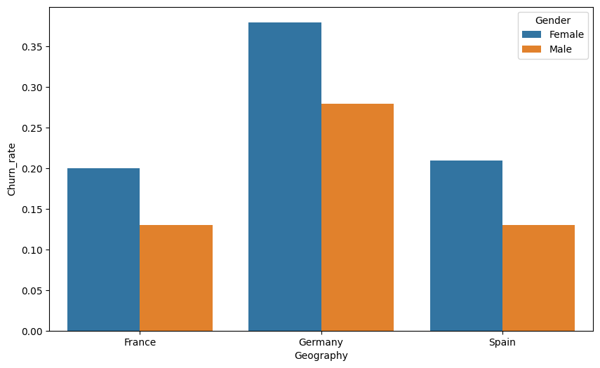
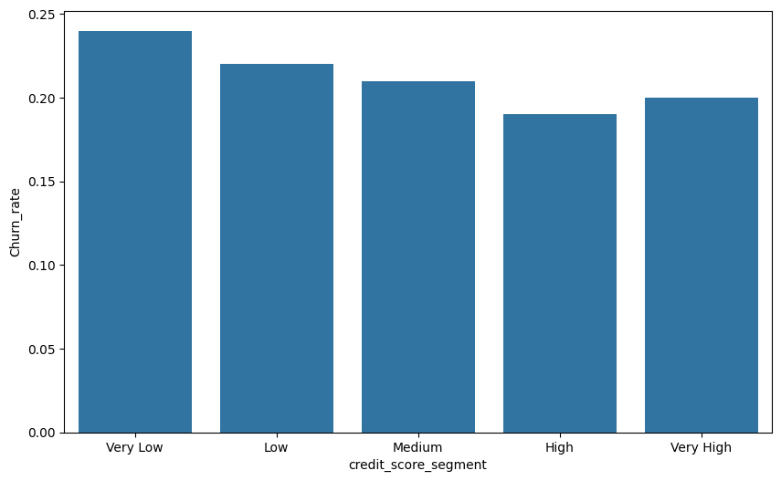
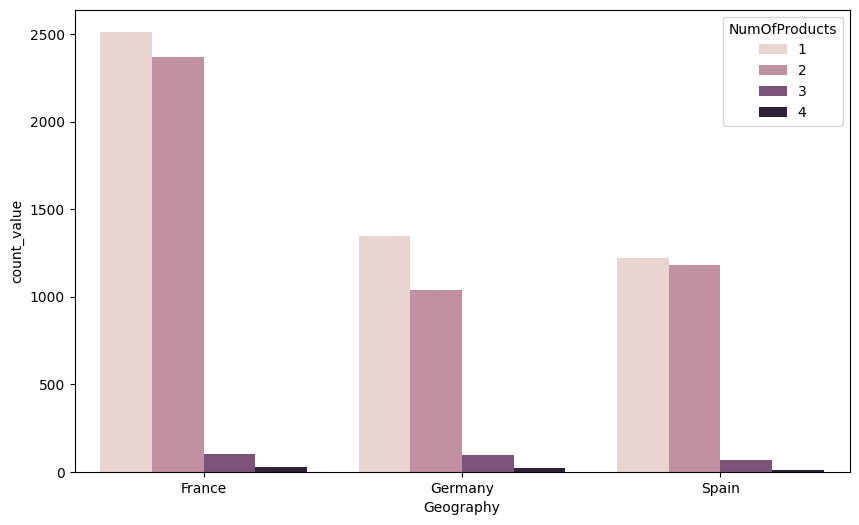

# Bank Churn Customer Data Analyst
Explore Data Analyst on bank customer churn to get insights and recommendations for the Customer Success and Product Teams.

---

## 📊 Insight for Customer Success

   
  <em>Figure 1. Gender Female have the highest churn rate than Male in every country (A/B test hypothesis, H₀ rejected).</em>

- Female customers show a higher churn rate across all countries — validated with A/B testing (H₀ rejected).  
- Customers with or without a credit card have similar churn rates.  
- A/B testing shows no significant difference in churn based on customer tenure — churn rate remains similar across tenures.  
- Credit score significantly affects churn — A/B test rejects H₀.  

Credit score segmentation:
| Range | Label |
|--------|--------|
| < 500 | Very Low |
| 500–550 | Low |
| 550–650 | Medium |
| 650–750 | High |
| > 750 | Very High |

   
  <em>Figure 2. Churn rate distribution by credit score segmentation.</em>

---

## 🧩 Insight for Product Team

   
  <em>Figure 3. Highest churn rate in product number 3 and 4 (90–100%) across all countries.</em>

- Highest churn rate is observed in **product 3 and 4** (90–100% churn).  
- Consistent churn issue for product 3 and 4 across every country.  
- Product 3 and 4 have fewer users compared to 1 and 2 (average 50–100 customers).  
- A/B testing confirms this result — H₀ rejected.  

---

## 🧭 Recommended Actions

### 🧑‍🤝‍🧑 Customer Success Team
- Increase monitoring for **female customers**, who have higher churn risk.  
- Focus on customers with **credit scores between 500–650**, since they show higher churn probability.  
- Give special attention to **Germany**, which has the highest churn rate among all countries.  

### 🧰 Product Team
- Prioritize review or possible **removal of products 3 and 4**, as they consistently show high churn (90–100%) across all regions.  
- Consider **product redesign or rebranding** to improve adoption and reduce churn.  

---

### 📎 Notes
- All insights validated using **A/B testing**.  
- Segmentation and churn analysis done with **Python (Pandas, Matplotlib, and Statsmodels)**.  
- Folder `docs/` contains all visual insight charts used in this analysis.
